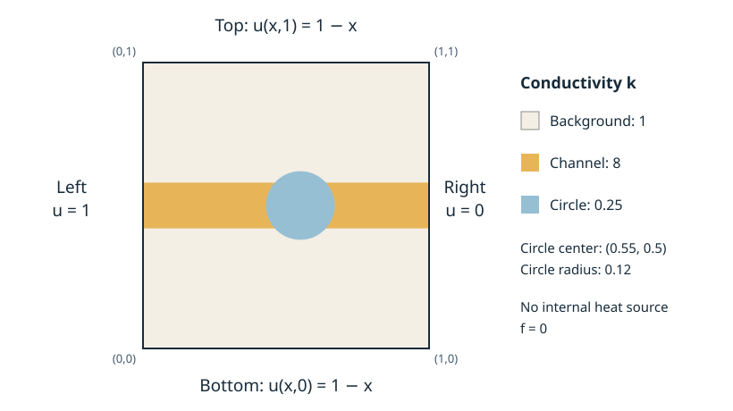

# PA05 Code: Sparse iteration and heat flow in a composite plate

Math 589A, Fall 2026. Numbook Sections 4.8-4.10, with the least-squares
viewpoint from Section 4.7. There are two linked submissions: **PA05 Code**
(100 points) and the fixed-layout **PA05 Written** PDF (100 points).
See Gradescope for due dates and their combined course-grade weight.

**Start with [Physical and mathematical background](#physical-and-mathematical-background)
below.** It explains the plate, derives the equations from heat balance, and
connects the neighbor-sum notation to the five-point Poisson stencil in
Numbook Section 4.9. No previous heat-transfer course is assumed.

Implement five short numerical routines in **`src/sparse.cpp`**, using C++17.
Start from PA04's approach: contiguous arrays, ordinary loops, a small library,
and Make. You may consult and acknowledge the public Arizona-Math examples
and use AI assistance, but you must verify and explain your submitted work.

## The two experiments

1. **Smooth Poisson problem.** On the unit square solve
   `-Delta u = 2*pi^2*sin(pi*x)*sin(pi*y)`, with zero boundary values.
   The continuum solution is `sin(pi*x)*sin(pi*y)`. Use it to distinguish
   algebraic residual, iterative solution error, and discretization error.
2. **Composite plate.** There is no volume heat source. All boundary points
   have temperature `g(x,y)=1-x`. Compare a uniform material with a horizontal
   conducting channel and a poorly conducting circular inclusion. Conductivity at
   a face midpoint is 0.25 inside the disk centered at (0.55,0.5) with radius
   0.12; outside the disk it is 8 when `abs(y-0.5)<0.08`, and 1 otherwise.
   The disk takes precedence over the channel. These values and this face
   sampling rule DEFINE the discrete model; no interface averaging is required.

The supplied `examples/problems.h` assembles both problems. Read it and derive
the formulas in Written. You implement the matrix operations and solvers.
The grader also supplies other positive face conductances; do not assume
constant coefficients, a particular picture, or a square grid.

## Grid and storage conventions

There are `nx` by `ny` INTERIOR unknowns; boundaries are excluded.
`hx=1/(nx+1)`, `hy=1/(ny+1)`, and `p=j*nx+i` for zero-based indices.
The point is `((i+1)*hx,(j+1)*hy)`. The five arrays in `Grid` contain
the actual matrix entries:

| Array | Entry in row p | Neighbor |
|---|---|---|
| d | A[p,p] > 0 | p |
| w | A[p,p-1] <= 0 | west, if i>0 |
| e | A[p,p+1] <= 0 | east, if i+1<nx |
| s | A[p,p-nx] <= 0 | south, if j>0 |
| n | A[p,p+nx] <= 0 | north, if j+1<ny |

Missing-neighbor coefficients are zero, and must NOT cause out-of-range reads
or row wrapping. In particular, multiplying zero by `x[-1]` is still invalid.
Handle one-by-one and one-cell-wide grids with these same rules.

For each interior point, let the four positive *scaled* face conductances be
`gw=kw/hx^2`, `ge=ke/hx^2`, `gs=ks/hy^2`, `gn=kn/hy^2`.
The scaling divides physical conductance by the cell area, as derived below.
The diagonal is their sum, INCLUDING faces adjacent to the boundary.
For an interior neighbor the corresponding off-diagonal is minus its
conductance. For a boundary neighbor, put zero in that off-diagonal array
and add `conductance * prescribed_temperature` to the right-hand side.
Interior neighbors share the same conductance, giving a symmetric matrix.
Every supplied system is a connected positive-conductance Dirichlet grid,
or a positive uniform scaling of such a system, and hence is positive definite.

Five occupied diagonals take `5*nx*ny` doubles. Do not allocate a dense matrix,
store the whole intervening band, or explicitly form an iteration matrix.
All numerical routines must use O(nx*ny) storage and O(nx*ny) work per sweep.

## Functions to implement

`include/sparse.h` is the interface used by both local tests and the grader.

1. `apply(a,x,y)`: compute `y=A*x`. The arrays x and y are distinct.
2. `jacobi_sweep(a,b,old_x,new_x)`: one simultaneous Jacobi sweep. The two
   iterate arrays are distinct. Preserve old_x.
3. `sor_sweep(a,b,x,omega)`: one in-place SOR sweep in increasing p order.
   The supplied parameter satisfies `0<omega<2`. At omega=1 this is
   lexicographic Gauss-Seidel.
4. `solve(a,b,x,method,omega,rtol,atol,max_iter)`: start at the SUPPLIED x.
   Use Jacobi for method=0 or lexicographic SOR for method=1. In Jacobi mode
   omega is ignored. Test the initial residual and then after EVERY sweep.
5. `solve_fast(a,b,x,rtol,atol,max_iter)`: your optimized stationary iteration.
   The starter calls `solve` with SOR and omega=1.5, which is a valid fallback
   once you implement `solve`. Optimize this entry only after correctness.

The common stopping condition is

```
max(abs(b-A*x)) <= atol + rtol*max(abs(b))
```

Return `Result{iterations,residual,converged}`. The residual must be recomputed
from the final returned x, not an iterate difference or a stale recursive
quantity. Count completed sweeps; a red-plus-black pair is one sweep.
Already-converged input returns zero sweeps. With max_iter=0, inspect the
initial residual and return without updating. On exhaustion return the last
iterate, its residual, and whether it meets the tolerance. `solve_fast` may
check the residual less often, but must respect the budget and always check
the returned iterate. Do not silently return the previous iterate.

Assume valid finite arrays, nx,ny>=1, nonnegative tolerances and max_iter,
and the matrix assumptions above. No input-validation framework or exception
API is required in the numerical routines. Preserve a and b, and preserve x
in `apply` and `jacobi_sweep`. Workspace allocation inside solve/solve_fast is
allowed; avoid allocation inside a sweep. Use double precision throughout.

Use your own Jacobi/GS/SOR implementations. For `solve_fast` you may change
ordering, tune omega, precompute reciprocals, use a stencil directly, change
residual-check frequency, and use up to four OpenMP threads. Keep all trials
and tuning inside the measured call. A stencil implementation must use the
supplied coefficients. No Eigen, BLAS/LAPACK sparse solvers, FFT solves,
multigrid, or Krylov methods in the submitted routines. Such tools are welcome
for independent verification. Do not enable `-ffast-math`, alter precision,
recognize test cases, cache answers between runs, or access grader files.

Red-black SOR is a different ordering from lexicographic SOR. Explain its
dependencies; putting a parallel loop around lexicographic SOR is incorrect.
Parallelism is optional. The assigned methods suffice for performance credit.

## Build, test, and experiment

Use GCC with OpenMP (Linux or WSL is convenient):

```
make
make test
OMP_NUM_THREADS=1 ./build/demo 31 31 0 1 1.8
OMP_NUM_THREADS=4 ./build/demo 127 95 2 2 1.5 build/composite.csv
python3 scripts/plot.py build/composite.csv build/composite.png
python3 scripts/compare.py --n 128 --sweeps 100 --repeats 3
make submission
```

The unimplemented starter compiles but fails `make test`. The executable
arguments are `nx ny material method omega [CSV]`: material 0 is the smooth
Poisson case, 1 the uniform plate, 2 the composite plate; method 0 is Jacobi,
1 SOR, 2 fast. The last method chooses its own omega. The demo uses
rtol=1e-10, atol=1e-12, and max_iter=200000. Its timing covers the solver call;
plotting and CSV writing are outside that timing. For a timing table set
OMP_NUM_THREADS explicitly; do not use the machine's default thread count.

The library itself depends only on the C++ standard library and optionally
OpenMP. `compare.py` additionally needs NumPy; `plot.py` needs Matplotlib.
For a compiler without OpenMP, omit `-fopenmp` from CXXFLAGS and use sequential
code locally. The grader always supplies GCC with OpenMP.

For Written, run:

- Refinement: square smooth grids m=15,31,63,127, so h halves exactly.
  Use SOR or fast for the largest grid. Record independent residual and
  max error against the continuum solution. On square grids the exact
  DISCRETE solution is `(2*pi*pi/lambda_h)*sin(pi*x)*sin(pi*y)`, where
  `lambda_h=8/h^2*sin(pi*h/2)^2`. This provides an independent algebraic check.
- Iteration comparison: uniform and composite plates on 31x31 and 63x63;
  compare Jacobi, Gauss-Seidel, and SOR at omega=1.5 and 1.8, using the same
  stopping rule. Record iterations and times. Plot a composite plate on
  at least 127x95 interior points. The uniform plate has exact discrete
  temperature 1-x and provides another check.
- Language comparison: 100 fixed Jacobi sweeps on 64x64 and 128x128 grids
  using `scripts/compare.py`. It compares Python loops, NumPy slices, and
  your C++ routine. Check the checksums and report median times.
- Scaling: run your fast solver on a 255x191 composite plate with 1,2,4
  threads, three repetitions each. Report medians, speedups relative to
  your own one-thread version, and the compiler/CPU/environment. Sequential
  implementations are acceptable; report honestly if there is no speedup.

The supplied demo's second residual calculation calls your own apply routine;
also check independently in Python, MATLAB, or with a small dense matrix.
Compare a small solve with PA04 or a trusted solver. Add one test of your own.

## Code scoring and leaderboard

| Component | Points |
|---|---:|
| apply, including boundary gaps | 15 |
| Jacobi sweep | 10 |
| lexicographic GS/SOR sweep | 15 |
| uniform Poisson solves | 15 |
| variable conductances and nonzero initial guesses | 15 |
| rectangular/thin grids and fast-solver correctness | 5 |
| stopping, scaling, zero RHS, iteration budgets | 10 |
| verified performance | 15 |

Performance eligibility requires all 85 correctness points. The grader
recomputes residuals independently; merely reporting convergence is insufficient.
The timing reference is straightforward sequential lexicographic SOR with
omega=1.5 and a residual check after every sweep. You can reproduce that
baseline using your required `solve` routine.

Three benchmark families use uniform coefficients, a smooth positive
conductivity, and the composite channel/inclusion. Dimensions are 128x128,
192x160, and 224x192. Right-hand sides are generated from smooth combinations
of grid modes; initial guesses are zero. Use rtol=1e-8, atol=1e-12, and at
most 60000 sweeps. These inputs are mathematical problems, not data to embed
in the implementation. Additional correctness cases use other dimensions.

For each case the grader alternates reference and student runs, takes the
median of three fresh-process wall times for each, and computes reference
time / student time. The leaderboard's **Verified speedup** is the geometric
mean of these three ratios; higher is better. **Solve time (s)** is the sum
of the three student median times; lower is better. Times include process
startup, binary input/output, solver setup, tuning, and iteration; compilation,
input generation, and independent checking are excluded. This same boundary
applies to reference and student. Each timed process has a 30-second limit.

Earn 5 points at each speedup level 1x, 2x, and 4x, with a 5% allowance at
each boundary (actual cutoffs .95,1.90,3.80). These are absolute reference
levels, not class-rank grades. The grader uses up to four virtual CPUs and
sets OMP_NUM_THREADS=4 and OMP_THREAD_LIMIT=4. No fourfold parallel speedup
is promised; algorithm, ordering, and memory use also affect performance.
Performance timeouts preserve correctness points. Grading near a threshold
may be rerun consistently by the instructor at the deadline.

## Submission and references

Upload **sparse.cpp**, or **build/submission.zip**, to PA05 Code. Only the
implementation is graded; the grader supplies the header and driver. Submit
the completed fixed-layout PDF to PA05 Written. Do not include PDFs or
generated binaries in the programming submission.

Useful public references:

- [C/Python Gaussian elimination](https://github.com/Arizona-Math/Math589A_GaussElimCAndPython):
  short kernels, Make, contiguous storage, independent checks.
- [C fixed-point iteration and Python wrapper](https://github.com/Arizona-Math/Math589A_Fall25_Assignment4).
- [Sequential C++, Python, and OpenMP examples](https://github.com/Arizona-Math/FiveLevelsOfRungeKutta).

NumPy's fast operations already run in compiled code. Interpret the measured
comparison; do not claim that C++ must beat every Python numerical program.
Record which ideas/code came from old assignments, public examples, or AI.

## Physical and mathematical background

### 1. What is being modeled?

Imagine a thin square plate made of materials that conduct heat at different
rates. Its four edges are held at prescribed temperatures by external
reservoirs. We seek the **steady temperature** $u(x,y)$ inside the plate:
the temperature no longer changes with time, although heat can still flow
through the plate. This is a boundary-value problem, not a time simulation.

Assume that temperature is uniform through the thickness, that there is no
heat exchange through the front and back surfaces, and that each material
conducts equally in every direction. Its conductivity $k(x,y)>0$ is known
and independent of temperature. These assumptions make the problem linear.
Coordinates, temperatures, conductivity, and sources below are scaled to
dimensionless quantities; equivalently, interpret the balances per unit
plate thickness before choosing units.

There are three distinct physical quantities:

| Quantity | Meaning |
|---|---|
| $u(x,y)$ | Temperature, the unknown scalar field |
| $\mathbf J(x,y)$ | Heat flux, a vector giving the direction and rate of heat transport |
| $f(x,y)$ | Heat generated inside the material per unit area and unit thickness; positive for heating |

For the plate experiment there is **no internal heat generation**, so $f=0$.
The imposed edge temperatures drive the flow. On **every** point of the
boundary we prescribe $g(x,y)=1-x$: the left edge has temperature 1, the
right edge 0, and the top and bottom edges both vary linearly from 1 to 0.
In particular, the top and bottom are prescribed-temperature boundaries,
not insulated boundaries.



*Material map, not a temperature plot.* The circle replaces the channel
where they overlap. The value $k=0.25$ describes a poorer conductor, not a
hole or a perfect insulator: heat still passes through it. The value $k=8$
describes a better conductor. All interfaces are in perfect thermal contact;
there is no extra contact resistance.

### 2. From Fourier's law to the book's Poisson equation

Fourier's law says that heat flows down the temperature gradient:

$$
\mathbf J=-k\nabla u.
$$

For example, when $u=1-x$ and $k=1$, the gradient points left and the flux
$\mathbf J=(1,0)$ points right, from hot to cold. Higher conductivity gives
more flux for the same temperature gradient; it does not generate heat.

At steady state, the heat leaving any small region $V$ must equal the heat
generated inside it. With outward unit normal $\mathbf n$, this gives

$$
\int_{\partial V}\mathbf J\cdot\mathbf n\thinspace ds
=\int_V f\thinspace dA.
$$

The divergence theorem therefore yields $\nabla\cdot\mathbf J=f$, or

$$
\boxed{-\nabla\cdot(k\nabla u)=f\quad\hbox{in }(0,1)^2,
\qquad u=g\quad\hbox{on the boundary}.}
$$

When $k=1$, this is exactly **$-\Delta u=f$ in Numbook Section 4.9**.
The composite material generalizes that example by letting conductivity
vary. Where $k$ is smooth,
$-\nabla\cdot(k\nabla u)=-k\Delta u-\nabla k\cdot\nabla u$;
thus replacing the operator by $-k\Delta u$ would generally be wrong.
At a material interface, interpret the equation through heat balance:
temperature and normal heat flux are continuous, even though conductivity
and the normal temperature derivative may jump. We will discretize fluxes,
so no derivative of a discontinuous $k$ is needed in the program.

The supplied experiments are related as follows:

| Experiment | Conductivity | Source | Boundary temperature | Known temperature |
|---|---|---|---|---|
| Smooth Poisson | $k=1$ | $2\pi^2\sin(\pi x)\sin(\pi y)$ | $g=0$ | $u=\sin(\pi x)\sin(\pi y)$ in the continuum |
| Uniform plate | $k=1$ | $f=0$ | $g=1-x$ | $u=1-x$, also exact on the grid |
| Composite plate | Channel, circle, and background shown above | $f=0$ | $g=1-x$ | To be computed |

The first case supplies a smooth known answer for checking accuracy. The
second checks nonzero boundary data. The third asks how the same boundary
temperatures produce a different interior temperature field when the
material changes. The conductivity alone does not determine the temperature;
the boundary conditions and the heat balance matter too.

### 3. Derive the four-neighbor equation

For this derivation use mathematical indices $i=1,\ldots,n_x$ and
$j=1,\ldots,n_y$, with $x_i=ih_x$, $y_j=jh_y$,
$h_x=1/(n_x+1)$ and $h_y=1/(n_y+1)$. Write $U_{ij}$ for the approximate
temperature there. The boundary indices are $0,n_x+1$ and $0,n_y+1$.
In C++, the corresponding interior indices are `i-1,j-1`, so this
mathematical node is stored at `p=(j-1)*nx+(i-1)`.

Draw a small rectangle of width $h_x$ and height $h_y$ centered at the node.
Its east and west faces lie halfway to the adjacent nodes. Approximate the
positive-$x$ fluxes at these faces by temperature differences:

$$
J_E=-k_E\frac{U_{i+1,j}-U_{ij}}{h_x},\qquad
J_W=-k_W\frac{U_{ij}-U_{i-1,j}}{h_x}.
$$

Here $k_E=k(x_i+h_x/2,y_j)$ and $k_W=k(x_i-h_x/2,y_j)$.
Similarly, the positive-$y$ fluxes are

$$
J_N=-k_N\frac{U_{i,j+1}-U_{ij}}{h_y},\qquad
J_S=-k_S\frac{U_{ij}-U_{i,j-1}}{h_y}.
$$

The east and west faces each have length $h_y$; the north and south faces
each have length $h_x$. Outward heat flow minus inward heat flow balances
generation in the rectangle:

$$
h_y(J_E-J_W)+h_x(J_N-J_S)=h_xh_y f_{ij},
\qquad f_{ij}=f(x_i,y_j).
$$

This is the discrete balance obtained by approximating face fluxes and the
source integral. Substitute the four flux formulas and divide by the cell
area $h_xh_y$:

$$
\frac{k_W}{h_x^2}(U_{ij}-U_{i-1,j})
+\frac{k_E}{h_x^2}(U_{ij}-U_{i+1,j})
+\frac{k_S}{h_y^2}(U_{ij}-U_{i,j-1})
+\frac{k_N}{h_y^2}(U_{ij}-U_{i,j+1})=f_{ij}.
$$

**Check against the book.** If all four conductivities equal 1 and
$h_x=h_y=h$, this reduces to

$$
\frac{4U_{ij}-U_{i-1,j}-U_{i+1,j}-U_{i,j-1}-U_{i,j+1}}{h^2}
=f_{ij},
$$

the five-point approximation to $-\Delta u=f$ in Section 4.9. The new
equation is this same stencil with a separate conductivity on each face.

Adjacent interior nodes must use the **same** conductivity for their shared
face. The flux leaving one rectangle then enters the other, so interior
flows cancel when balances are added. This also explains why the resulting
matrix is symmetric. For this assignment, sampling $k$ at the face midpoint
defines the discrete composite model. Other treatments of interfaces are
possible; do not add an averaging rule to the supplied assembly. In
particular, the smooth Poisson problem's second-order accuracy does not by
itself establish second-order accuracy across a discontinuous interface.

### 4. What does the compact neighbor sum mean?

The notation used in Written simply abbreviates the four terms just derived:

$$
\sum_{q\sim p}c_{pq}(u_p-u_q)=f_p.
$$

- $p$ is one grid node, and $u_p$ is its temperature.
- $q\sim p$ means that $q$ is one of its four nearest neighbors: west,
  east, south, or north. Boundary nodes are included in this sum.
- $c_{pq}=k_{\text{face}}/h_x^2$ for a horizontal neighbor and
  $c_{pq}=k_{\text{face}}/h_y^2$ for a vertical neighbor. A shared face gives
  $c_{pq}=c_{qp}>0$.
- **$f_p$ is the heat source at node $p$.** It has one node index. It is
  not an edge quantity $f_{pq}$. The flow between two nodes is a separate
  quantity, proportional to their temperature difference.

To be precise about units and scaling, let $a=h_xh_y$ be the cell area.
The physical conductance per unit plate thickness is $G_{pq}=a c_{pq}$:

$$
G_{pq}=k_{\text{face}}\frac{h_y}{h_x}\quad\hbox{(horizontal)},
\qquad
G_{pq}=k_{\text{face}}\frac{h_x}{h_y}\quad\hbox{(vertical)}.
$$

The heat flow from $p$ toward $q$ is
$Q_{pq}=G_{pq}(u_p-u_q)$, with $Q_{qp}=-Q_{pq}$.
The generation in the cell is $F_p=a f_p$.
Thus $\sum_{q\sim p}Q_{pq}=F_p$ is the unscaled heat balance, and dividing
by $a$ gives the displayed neighbor sum. We call $c_{pq}$ a *scaled face
conductance*; its factors $1/h_x^2$ and $1/h_y^2$ come from this division,
not from an additional physical law.

### 5. How boundary temperatures enter $Au=b$

Only interior temperatures belong to the unknown vector. If $q$ is a
boundary neighbor, its temperature is the known number $g_q$. Expand
the balance at node $p$ and move these known terms to the right:

```math
\left(\sum_{q\sim p}c_{pq}\right)u_p
-\sum_{\substack{q\sim p\\q\text{ interior}}}c_{pq}u_q
=f_p+\sum_{\substack{q\sim p\\q\text{ boundary}}}c_{pq}g_q.
```

This is one row of $Au=b$. Its diagonal is the sum of **all four** scaled
conductances; its off-diagonal entries are negative scaled conductances
for interior neighbors. The assembled right-hand side contains the source
**and** the boundary contributions. Consequently, $f=0$ does not mean $b=0$.

For example, a node with just its west neighbor on the boundary has row

$$
d_pu_p-c_Eu_E-c_Su_S-c_Nu_N=f_p+c_Wg_W,
\qquad d_p=c_W+c_E+c_S+c_N.
$$

The west array entry is zero because there is no west *unknown* to read;
the west face still contributes to the diagonal and to $b_p$. Omitting
that face from the diagonal would change the boundary condition.

Under row-major numbering, horizontal interior neighbors have offsets
$\pm1$ and vertical neighbors have offsets $\pm n_x$. This gives the five
arrays `d,w,e,s,n`. At the end of a row, offset $+1$ points to the next
row's first node, which is not a physical neighbor; the corresponding
entry must be zero. For a one-cell-wide grid some offsets coincide, but
the directional neighbor checks and arrays still describe the same stencil.

### 6. Why the iterative methods and least squares belong here

The heat balance can also be written as

$$
u_p=\frac{f_p+\sum_{q\sim p}c_{pq}u_q}{\sum_{q\sim p}c_{pq}},
$$

where boundary neighbors retain their prescribed values. With no internal
source, each interior temperature is a weighted average of its neighbors.
This is a useful physical and numerical check: a source-free steady plate
with these boundary temperatures should have no interior temperature below
0 or above 1 (up to numerical error).

Now apply Section 4.8. Jacobi computes every new interior value using the
previous sweep's neighbors. Gauss-Seidel uses newly available values during
the sweep. SOR blends the previous value with the Gauss-Seidel update using
the relaxation parameter. These are ways to solve the **same linear
system**; their sweep number is not elapsed physical time. Sparse storage
makes each sweep proportional to the number of unknowns, even though the
total number of sweeps can grow substantially under grid refinement.

There is also a connection to the least-squares material in Section 4.7:
a term $\tfrac12 c_{pq}(u_p-u_q)^2$ has derivative
$c_{pq}(u_p-u_q)$ with respect to $u_p$. Summing suitable squared
temperature differences, including prescribed boundary values, can
therefore produce the heat-balance equations as normal equations when
$f=0$. Written asks you to formulate that least-squares problem and justify
uniqueness. This mathematical quadratic functional is not the heat stored
in the plate.

Finally, distinguish three objects: the continuum temperature $u(x,y)$,
the exact solution of the discrete system, and the current iterate of your
solver. A small residual certifies balance of the **discrete** equations
to the chosen tolerance. It does not remove discretization error, and its
relation to solution error depends on conditioning. The smooth Poisson
experiment lets you measure these effects separately before interpreting
the composite plate.

**Reading guide.** Use Numbook Section 4.9 for the constant-conductivity
Poisson stencil, Section 4.8 for stationary iterations, and Section 4.7 for
least squares. For a short physical introduction to Fourier's law, see
[MIT Unified Engineering: Introduction to Conduction](https://web.mit.edu/16.unified/www/FALL/thermodynamics/notes/node116.html).
The derivation above supplies the variable-conductivity background needed
for this assignment; Written asks you to apply it, justify the matrix
properties, and interpret your computations.
